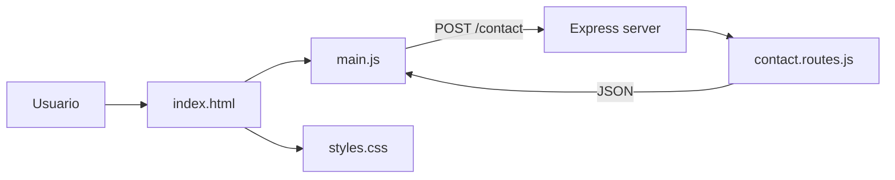
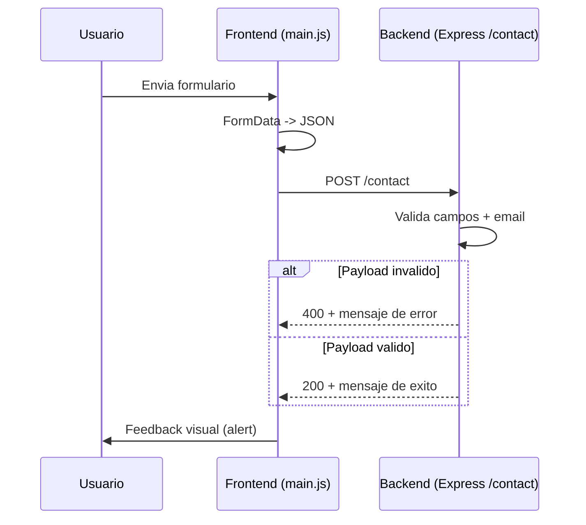

# Sofia Arano Ibarra - Web Portfolio

Portfolio personal orientado a mostrar perfil profesional, proyectos y capacidad tecnica con una base full-stack liviana (Node.js + Express + frontend estatico).

## Recruiter Snapshot
- Rol objetivo: Desarrolladora Web Full Stack Jr.
- Foco tecnico: JavaScript, Node.js, Express, SASS, arquitectura modular.
- Diferencial: combina frontend cuidado con backend funcional para contacto real.

## Live Project Context
- Tipo: Portfolio profesional personal.
- Objetivo: presentar experiencia, skills y proyectos en un sitio responsive.
- Extra tecnico: endpoint propio para formulario de contacto con validaciones.

## Tech Stack
- Backend: Node.js, Express 4
- Frontend: HTML5, CSS3, JavaScript Vanilla
- Estilos: SASS modular (partials por dominio)
- Tooling: npm scripts + nodemon

## Features Destacadas
- Formulario de contacto conectado a backend (`POST /contact`).
- Validacion de campos y email en API.
- Navbar dinamica con comportamiento adaptativo al scroll.
- Dark mode persistente en `localStorage`.
- Menu mobile accesible (hamburguesa, backdrop, `Escape`).
- Animaciones de entrada con `IntersectionObserver`.

## Arquitectura (High-Level)


## Rutas Actuales
- `GET /`: sirve `index.html` desde la raiz del proyecto.
- `POST /contact`: endpoint de contacto con validaciones.
- Estaticos desde `public/`:
- CSS: `/css/styles.css`
- JS: `/js/main.js`
- Imagenes: `/img/...`

## Flujo de Contacto End-to-End


## API
### `POST /contact`
Recibe:
```json
{
  "name": "string",
  "email": "string",
  "message": "string"
}
```

Reglas actuales:
- `name`, `email`, `message` son obligatorios.
- `email` se valida con regex simple.

Respuestas:
- `200 OK`: `{ success: true, message: "..." }`
- `400 Bad Request`: `{ success: false, message: "..." }`

## Estructura del Proyecto
```text
sofi-dev/
|-- server.js
|-- index.html
|-- routes/
|   `-- contact.routes.js
|-- public/
|   |-- js/
|   |   `-- main.js
|   |-- css/
|   |   |-- styles.css
|   |   `-- styles.css.map
|   |-- scss/
|   |   |-- styles.scss
|   |   |-- abstracts/
|   |   |-- base/
|   |   |-- components/
|   |   |-- layout/
|   |   |-- pages/
|   |   `-- themes/
|   `-- img/
|       |-- logo1.png
|       `-- icono.png
|-- package.json
`-- README.md
```

## Scripts
- `npm start`: ejecuta `node server.js`
- `npm run dev`: ejecuta `nodemon server.js`
- `npm run sass`: compila `public/scss/styles.scss` a `public/css/estilos.css`
- `npm run sass:watch`: compilacion SASS en modo watch

## Run Local
```bash
npm install
npm start
```

Si el puerto `3000` esta ocupado:
```powershell
$env:PORT=3001; npm.cmd start
```

## Notas Tecnicas
- El backend usa ESM (`import/export`) y ya esta configurado con `"type": "module"` en `package.json`.
- El servidor toma `PORT` desde variable de entorno y usa `3000` por defecto.
- Si aparece `EADDRINUSE` en el puerto `3000`, ya hay otro proceso escuchando ese puerto.
- En PowerShell, si `npm` esta bloqueado por politicas, usar `npm.cmd start`.

## Roadmap
- Integrar envio real de correo (Nodemailer/servicio SMTP).
- Sumar tests de integracion para `/contact`.
- Externalizar configuracion con variables de entorno (`PORT`, etc.).
- Unificar salida de estilos (`styles.css` vs `estilos.css`).
